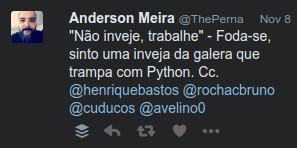
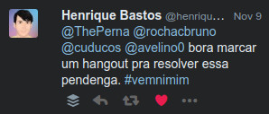
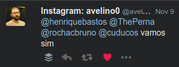
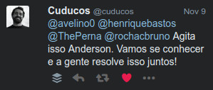

É bem provável que este post vai me servir como referencia no futuro… Que bom! Que os próximos sirvam como um “versionamento” da minha carreira.

Mas antes…

**TL;DR:**
O *“Não”* você já tem, então sempre que perguntas do tipo *“Será que eu devo arriscar?”* ou *“Será que estou preparado?”* aparecerem pra tirar suas noites de sono, pode ter certeza que SIM, vale a pena arriscar!

Desenvolvedores *“geralmente”* (não sei se existe uma pesquisa que comprove isso) tem um perfil mais introspectivo. Melhore suas *“soft skills”* falando com outros desenvolvedores mais experientes, alguns deles são mais acessíveis do que você imagina.

**Sozinho** você não chega a lugar nenhum.

Depois da minha primeira Python Brasil em outubro deste ano comecei a refletir sobre minha carreira (pra constar, estou desempregado) e sobre a atitude que várias pessoas ativas nas comunidades possuem. Sempre vejo essas pessoas como fonte de inspiração, de inovação e de casos de sucesso. Digo hoje que este sentimento aumentou principalmente pela forma bastante humilde e acolhedora que fui recebido não só na conferência mas em alguns fatos que vou narrar a seguir.

Sou programador Front-End, mas se você ler meu outro post vai notar meu perfil *“fuçador”*. Ter este perfil me ajuda em vários momentos, me atrapalha em outros, mas eu conto a respeito também num outro post, podem me cobrar.

Nestes 6 anos como Front-End eu sempre me senti um profissional incompleto, não sei se por estar mexendo com a parte visual dos sistemas e que é importantíssima na minha opinião pois a cada dia a complexidade e as particularidades delas aumenta, ou se pelo fato alguns programadores Back-End desvalorizarem o trabalho do Front, como se o Back-End fosse mais importante. Penso que eles se completam.

Estudei [Node.JS](https://nodejs.org) por um tempo, fiz até meu TCC com ele, gosto de usar JavaScript (aprendi a gostar), mas a linguagem que me enche os olhos é Python.

Inesperadamente vejo uma resposta do próprio [Henrique Bastos](http://henriquebastos.net) se prontificando a me ajudar. Como diria o próprio Henrique: **“_Totalmente excelente!_”**

Na sequencia [Thiago Avelino](https://avelino.run), um cara que sempre traz conteúdo técnico de qualidade para toda a comunidade, entrou na *“brincadeira”*.

Depois veio Eduardo Cuducos, um dos idealizadores do [Operação Serenata de Amor](https://serenata.ai/) e que eu tive oportunidade de conhecer na Python Brasil e dizer o quanto o [github dele](https://github.com/cuducos) era inspirador para mim.

Na sequencia outro grande desenvolvedor e produtor de conteúdo em português na linguagem Python chamado [Bruno Rocha](https://twitter.com/rochacbruno) e que eu tinha marcado no tuite também se prontificou a participar do hangout.

Trocamos vários tuites marcando o hangout para 10 dias depois, até que o Marcelo Belli lendo todo o nosso bate-papo quis participar também.

Chegado o dia do hangout, bastante ansiedade e um pouco de incredibilidade da minha parte, pois afinal de contas quem sou eu pra ter esse privilégio de falar com pessoas tão sensacionais da comunidades, a maioria deles nem ao menos me conhecia ou tinha trocado alguma ideia comigo.

Me senti numa verdadeira “roda viva” onde comecei por incentivo do Henrique a falar sobre minhas ansiedades, frustrações, sindrome do impostor, a experiência anterior como empreendedor e sobre a minha vontade de trabalhar com Python.

Feito o meu relato, O Henrique já chegou com uma atitude que você só espera de pessoas que estão próximas a você e te querem bem:

> “Perna, tu quer trabalhar com Python. Quantos currículos você enviou?”

Aquele misto de gosto amargo da realidade com a minha falta de empenho me desarmaram. Tentei argumentar:

> “Mas cara, as empresas só pedem profissional com experiência de mais de 2 anos no mercado com Python.”

Mas não teve jeito, tomei mais uma:

> “Foda-se os que eles pedem! O que vale é a sua atitude! Eles querem um cara com mais de 2 anos de experiência, então tenha a atitude de um cara que tem os 2 anos de experiência!”

O Henrique estava certo, se eu quiser trabalhar com Python, atitude é algo que não pode me faltar. Só um parenteses rápido, desde que comecei a trabalhar profissionalmente com programação sempre tive a pegada de estudar sem parar, o problema é eu sempre ficar esperando a tal “oportunidade” aparecer para que eu possa fazer alguma coisa.

Daí em seguida o Bruno Rocha que questionou sobre algumas coisas do tipo:

> “Cara, o que você quer fazer? Estou vendo a tua página, teus tuites, você diz que é Front-End mas não está claro o que e com o que você trabalha ou quer trabalhar.”

Outro tapa. Sabe aquele ditado que diz que “quem não é visto não é lembrado”? Pois é, esse tipo de coisa não acontece automagicamente, onde esperamos que alguém vai reconhecer nosso potencial, vai ver algum trabalho perdido no github e dizer “esse cara parece ser bom no que faz”… Isso não existe! Se você está esperando por algo parecido, sinto lhe dizer mas vai esperar muito e simplesmente pode não acontecer. Procure também mostrar o que você sabe fazer, isso não tem nada a ver com ego ou arrogância, compartilhar conhecimento faz parte da vida do desenvolvedor.

Falei um pouco sobre minha vontade de trabalhar remotamente e o Bruno disse que para isso seria muito importante melhorar o meu inglês. Isso é uma grande verdade, perdi esses dias atrás uma grande oportunidade por não saber bem o idioma. Farei um post sobre isso mais pra frente.

Compartilhando as suas histórias sobre empreendedorismo o Avelino me mostrou por experiência própria que as pessoas olham as *“pingas”* que tomamos mas nunca os *“tombos”* (e que tombos) que tomamos diariamente para conseguirmos atingir o que queremos.

Cuducos mostrou bastante sensibilidade mostrando que as coisas na verdade não estão boas pra ninguém, estamos todos no mesmo barco mas que é importante que possamos compartilhar nossas dores e sempre ter pessoas boas por perto para podermos conversar.

Tudo o que escrevi foi uma parte muito pequena do hangout (que durou 1:30h mais ou menos), tirei várias lições e pelo que vi, o Marcelo Belli que estava também participando acabou se identificando com várias partes da nossa conversa.

O que recebi aquele dia foi um trabalho de coaching de forma gratuita só com pessoas feras no que fazem, não tenho como não me sentir privilegiado por essa oportunidade, que espero retribuir, como dizem *“Small Acts”*.

Recebi *“homework”* onde eu teria que enviar 10 currículos para vagas de front-end e 10 para vagas de Python. Parecia fácil achar mas apanhei um pouco para conseguir bater essa meta na primeira semana.

Nas tarefas da semana seguinte não consegui cumprir devido a compromissos que assumi em trabalhos como freelancer. Essas tarefas incluem eu escrever bastante, compartilhar um pouco da minha experiência como desenvolvedor.

Este post é um marco de uma nova fase da minha vida, ainda estou desesperado mas ao mesmo tempo estou conseguindo administrar o desespero porque em algum momento algo tem que dar certo, pois segundo o meu amigo Cuducos:

Está com medo? Vai com medo mesmo!

Obrigado!